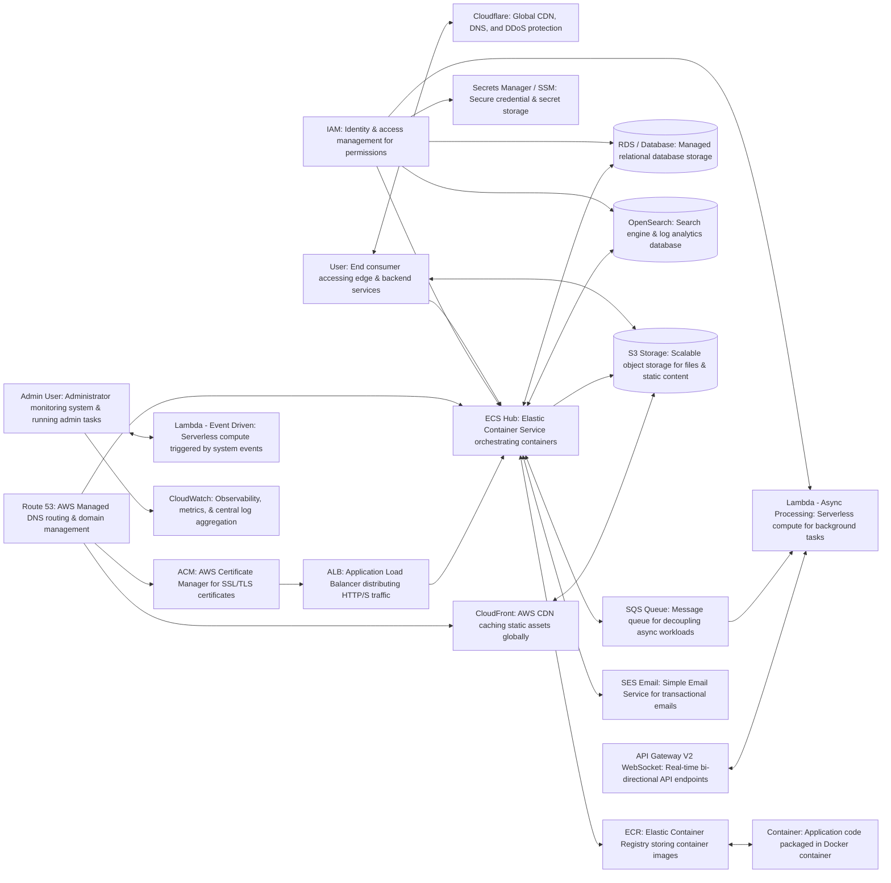

# AWS Architectures

1. A simple complete one

> from: https://www.youtube.com/watch?v=qrr5EnJQWlY

## Service Descriptions

### Entry Points & Users

- **User**: The end-user or client application accessing system entry points, static assets, and containerized backend services.
- **Admin (Admin User)**: System administrators who monitor application operations, inspect metrics/logs via CloudWatch, and execute event-driven administrative routines.

### Edge & Routing

- **Cloudflare**: Third-party Content Delivery Network (CDN), Web Application Firewall (WAF), and DNS management provider used for high-capacity edge caching and DDoS protection.
- **Route 53**: AWS managed Domain Name System (DNS) web service that routes user traffic to AWS endpoints (CloudFront, ECS) and manages domain records.
- **CloudFront**: AWS Content Delivery Network (CDN) that delivers data, static files, and APIs securely with low latency by caching content at edge locations globally.

### Security & Certificates

- **ACM (AWS Certificate Manager)**: Managed service for provisioning, renewing, and deploying SSL/TLS certificates to secure public endpoints (e.g., ALB).
- **IAM (Identity and Access Management)**: AWS core security service for defining roles, policies, and granular permissions for AWS compute services and users.
- **Secrets Manager / SSM (Parameter Store)**: Secure storage services for encrypting, storing, and automatically rotating application secrets, database credentials, and config parameters.

### Core Compute & Load Balancing

- **ALB (Application Load Balancer)**: Layer 7 load balancer that receives encrypted HTTPS traffic and distributes requests across containerized application targets.
- **ECS Hub (Amazon Elastic Container Service)**: Managed container orchestration service that provisions, scales, and manages running Docker container workloads.
- **Container**: The actual microservice/application unit running inside Docker, executing application logic in an isolated container environment.
- **ECR (Amazon Elastic Container Registry)**: Fully managed Docker container registry used to store, manage, and pull container images for deployment.

### Databases & Storage

- **RDS / Database (Amazon Relational Database Service)**: Managed relational database service (e.g., PostgreSQL, MySQL) for structured persistent application data storage.
- **OpenSearch**: Managed search and analytics engine used for fast full-text searching, log aggregation, and real-time operational analytics.
- **S3 Storage (Amazon Simple Storage Service)**: Scalable object storage service for storing static files, media uploads, backup archives, and website assets.

### Integration, Messaging & Serverless

- **SQS Queue (Amazon Simple Queue Service)**: Fully managed message queuing service for decoupling application components and queueing async jobs.
- **SES Email (Amazon Simple Email Service)**: Managed email delivery service used for sending transactional emails (notifications, verification emails, password resets).
- **API Gateway V2 WebSocket**: API management service supporting persistent, real-time bi-directional WebSocket communication between clients and backend handlers.
- **Lambda - Async Processing**: Serverless compute function triggered by SQS queue events to process background jobs asynchronously without managing servers.
- **Lambda - Event Driven**: Serverless compute function executing code in response to system events, configuration changes, or admin operations.
- **CloudWatch**: AWS monitoring and observability platform that collects metrics, aggregates application logs, and triggers alarms for system operational health.
