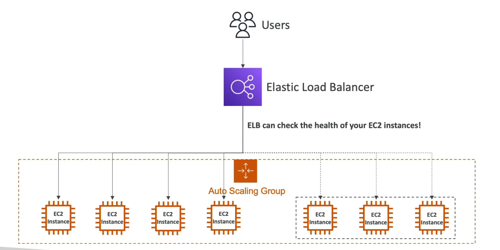

# Auto scaling group [ASG]

- Load of websites and applications can change
- In the cloud, we can create/remove servers quickly

- The goal of auto scaling group (ASG) is to:
  - scale out (add EC2 instances) to match increased load
  - scale in (remove EC2 instances) to match decreased load
  - ensure a minimum and maximum number of EC2 instances running
  - AUTOMATICALLY REGISTER new instances to LB
  - Re-create an EC2 instance in case a previous one is terminated (ex: if unhealthy)

- ASG are free, we only pay for the underlying EC2 instances

```
|----| mininum capacity [ex: 2 instances]
|--------| desired capacity [ex: 4 instances]
|------------| maximum capacity [ex: 7 instances]
```

- Also, the ELB can inform the ASG which instances are unhealthy and the ASG can terminate the instances that are deemed unhealthy by the ELB

> It's a great combination using an ELB and a ASG



## ASG attributes

- A launch template (previously called "launch configurations")
  - AMI + instance type
  - EC2 user data
  - EBS volumes
  - Security groups
  - SSH key pair
  - IAM roles for EC2 instances
  - Network + subnet information
  - LB info
- Min / max size / initial capacity
- Scaling policies

### Scaling policies + CloudWatch

- It's possible to scale out/in an ASG based on CloudWatch alarms
- An alarm monitors a metric (ex: average CPU, custom metric)
  - Metrics such as average CPU are computed for the overall ASG instances
- Based on the alarm, we can create scale `___` policies for `___` the number of instances
  - out/up -> increase
  - in/down -> decrease

## Hands on

- EC2 / Auto scaling / Auto scaling groups
- Select or create a launch template
- Select the specific parameters
- Once it's created, you can go to EC2 / Auto Scaling Groups / <Group>
  - then go to the activity history
  - also instance management

## ASG and ELB
