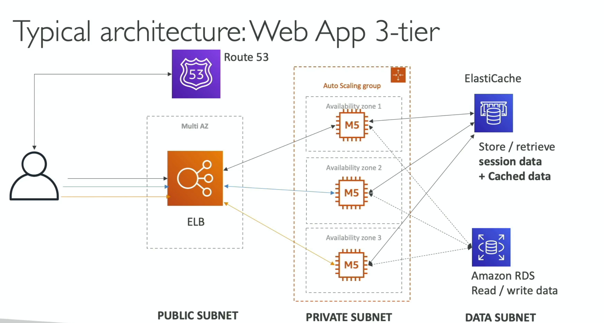

# Beanstalk

Typical web app 3-tier architecture


- Since most web apps have a similar architecture, why don't we reuse as much as possible?
  - managing infra
  - deploying code
  - configuring dbs, lbs, etc
  - scaling concerns

- Elastic beanstalk is a solution for that, it allows a developer-centric way of deploying an application on AWS
- It is a PaaS [Platform as a service]
  - allows devs to deploy and scale web apps without manually configuring the underlying infra
  - what's the difference from this and heroku?
    - you retain full control over all underlying AWS resources
      - under the hood beanstalk uses AWS CloudFormation to orchestrate the infra
      - we can SSH into the instances, etc. Fully managed
- Beanstalk is free, but we pay for the underlying instances

## Components

- Application: collection of Elastic Beanstalk components (environments, versions, configuration, etc)
- Application version: iteration of your application code
- Environment: collection of aws resources running an application version
  - only one application version at a time
  - possible to spin multiple isolated environments under one application, (dev, staging, production)

```
                 --<---- update version --<-
                |                           |
create   ----> upload ---> launch  -----> manage
application    version      environment   environment
                |                           |
                ->-- deploy new version -->--
```

## Environment tiers

- Elastic beanstalk provides 2 distinct architectural models:

1. Web server tier:
   - built for sync user-facing HTTP/HTTPS traffic
   - provisions a standard web stack: route 53 -> ELB -> ASG

2. Worker tier:
   - built for async background processing or long-running compute jobs
   - provisions an Amazon SQS queue alongside an ASG running the SQS daemon
     - it polls SQS and forwards messages via local HTTP POST requests to your worker application

```
[ Web Server Tier ]
Client ──► [ Route 53 ] ──► [ ALB ] ──► [ Auto Scaling EC2 Instances ]
                                            │
                                            │ (Pushes heavy job)
                                            ▼
[ Worker Tier ]                     [ Amazon SQS ]
                                            │
                                            ▼
                               [ SQS Daemon / Worker EC2s ]
```

## Deployment strategies [High-yield SAA/DVA Exam topic]

Beanstalk natively manages version rollouts across your EC2 fleet

- All at once: deploys all instances simultaneously
  - fast, but causes downtime while servers restart
- Rolling: updates instances in small batches
  - no complete downtime, only reduced serving capacity during the update
- Rolling with additional batch: launches a temporary new batch of instances first to maintain 100% serving capacity during the update
  - no downtime, no reduced capacity
- Immutable: launches a completely separate temp ASG with the new version, health checks, and terminates the old fleet
  - safest for prod, zero capacity loss, simple rollback
- Traffic splitting [canary]: directs a % of incoming traffic to a newly deployed batch for an evaluation window before completing the rollout
- Blue/green [environment URL swap]: launch a completely new environment (`green`), test it independently, and trigger a swap environment cnam in route 53 to redirect all traffic instantly

## Database pattern: the SAA Architecture trap

- Beanstalk allows you to launch an RDS db directly inside the environment config
  - HOWEVER, DO NOT USE IT for PROD
    - production anti-pattern: if you terminate the beanstalk environment, the RDS db is deleted along with it
  - dev/test: ok, convenient because beanstalk manages everything together

> Production best practice: ALWAYS PROVISION the RDS DB OUTSIDE of Beanstalk (using terraform, cdk, or RDS console), and pass the string/credentials to beanstalk instances via environment variables/aws secrets manager
