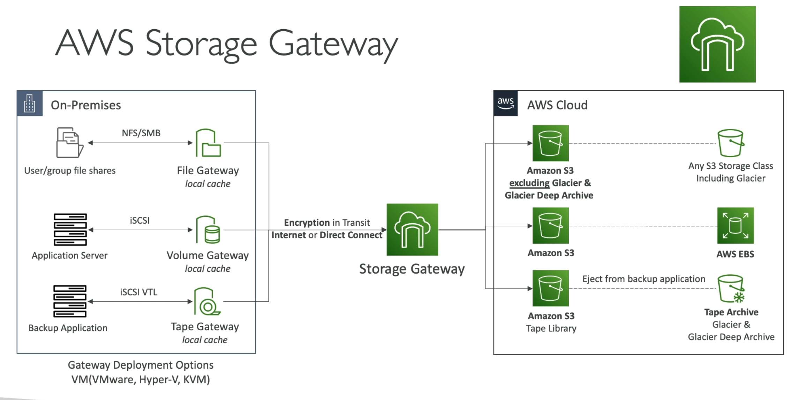

# Storage Gateway

- AWS suggests "hybrid cloud"
  - part of infra is on the cloud and part is on-premise
- Why?
  - long cloud migrations
  - security requirements
  - compliance requirements
  - IT strategy
- S3 is a proprietary storage technology, unlike EFS / NFS, so how do you expose the S3 data on-premises?
  - AWS Storage Gateway

- AWS storage gateway is a bridge between on-premises data and cloud data
- Use cases:
  - DR
  - backup and restore
  - tiered storage
  - on-premises cache and low-latency files access
- Types of storage gateway
  - s3 file gateway
  - volume gateway
  - tape gateway

## S3 File gatway

- Protocols supported: NFS/SMB
- Configured s3 buckets are accessible using the NFS and SMB protocol
- Most recently used data is cached in the file gateway
- Supports:
  - S3 standard
  - S3 standard-IA [Infrequent Access]
  - S3 One zone-IA
  - S3 intelligent tiering
- Transition to s3 glacier using a lifecycle policy
- Bucket access using IAM roles for each file gateway
- SMB protocol has integration with Active Directory [AD - Windows] for use auth

```
|[corporate data center]                  |                  | [aws cloud]                                                    |
| application ----------- S3 file gateway | <---- HTTPS ---> |  S3 standard                                                   |
| server      NFS or SMB                  |                  |  S3 standard-IA   -------> [lifecycle policy] ----> S3 glacier |
                                                             |  S3 one zone-IA                                                |
                                                             |  S3 intelligent tiering                                        |
```

## Volume gateway

- Protocol supported: iSCSI [block storage]
- Block storage using iSCSI protocol backed by s3
- Backed by EBS snapshots, which can help restore on-premises volumes
- Cached volumes: low latency access to most recent data
- Stored volumes: entire dataset is on premise, scheduled backups to s3

```
|[corporate data center]                  |                  | [aws cloud]                                  |
| application ----------- Volume gateway  | <---- HTTPS ---> |  [region]                                    |
| server      iSCSI                       |                  |  S3 bucket   -------> [Amazon EBS snapshots] |
```

## Tape gateway

- Protocol supported: iSCSI [emulating virtual tape libs]
- Replaces physical tape infra with virtual tapes stored in Amazon s3 and s3 glacier
  - integrates with existing enterprise backup applications [e.g. Veeam, Veritas, or Commvault]
- Virtual Tape Lib [VTL] backed by S3 and glacier

```
|[corporate data center]                       |                  | [aws cloud]                                                        |
| backup ------------- Media Changer -- Tap    | <---- HTTPS ---> |  [region]                                                          |
| server      iSCSI |-- Tape drive   -- gateway|                  |  Virtual tapes stored in s3 ----- Archived tapes stored in Glacier |
```

## Summary



## Storage gateway vs. FSx

- FSx [native cloud file systems]
  - what it is:
    - fully managed, native file storage service
    - runs entirely inside AWS cloud
  - primary use: when applications running on the cloud [ec2/ecs] need high-performance, shared file storage
  - exam rule of thumb: if the question asks for a MANAGED FILE SYSTEM inside AWS that multiple ec2 instances need to mount concurrently via SMB or NFS
    - EFS: for linux
    - FSx: for specialized workloads [windows or HPC]

- Storage gateway [hybrid bridge]
  - what it is:
    - hybrid storage integration service
    - allows on-prem data center to connect to AWS cloud storage [s3/FSx] by installing a virtual appliance/hardware gateway locally
  - primary use case:
    - when systems sitting on-prem need to interact with AWS storage using standard local protocols [NFS, SMB, iSCSI]
    - when you want local caching of cloud data to reduce latency
  - exam rule of thumb: if the question mentions on-premise servers neeting to read/write to AWS cloud storage using local protocols like NFS/SMB, storage gateway is the answer

| Feature                      | Amazon FSx                                  | AWS Storage gateway                                             |
| ---------------------------- | ------------------------------------------- | --------------------------------------------------------------- |
| Primary location of workload | in the AWS cloud                            | Briding on-prem infra to aws                                    |
| Primary purpose              | high-performance, native cloud file sharing | Hybrid cloud extension, local caching, and on-prem access to S3 |
| Protocols used               | SMB, NFS, Lustre, ZFS                       | NFS, SMB, iSCSI                                                 |
