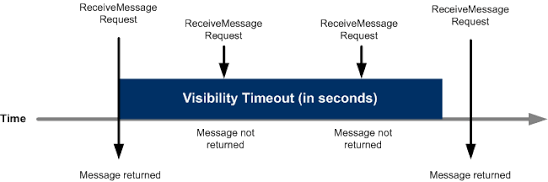

# SQS [Simple Queuing Services]

- Fully managed message queue where a component [producer] sends a message to a queue
- A single consumer pull and processes it

```
    [send messages]   [poll messages]
producer ---             --- consumer
producer --- [SQS Queue] --- consumer
producer ---             --- consumer
                         --- consumer
```

- Dead-Letter Queues [DLQ]
  - Secondary queue where messages that repeatedly fail processing [poison pills] are routed for isolation and debugging

## Standard Queue

- Oldest offering [over 10 years old on AWS]
- Decouples applications

- Attributes
  - unlimited throughput, unlimited number of messages in queue
  - default retention of messages: 4 days, maximum 14 days
  - low latency (< 10ms on publish and receive)
  - max 1024kb per message sent

- Can have duplicated messages [at least once delivery]
  - application code needs to ensure idempotency
- Can have out of order messages [best effort ordering]

### Producing messages

- Produced to SQS using the SDK [SendMessage API]
- Message is persisted in SQS until a consumer deletes it
- Message retention: default 4, up to 14 days

- Example: send an order to be processed
  - order_id
  - customer_id
  - any_attributes

```
producer ---> [message] ---> [SQS]
            up to 1024kb
```

### Consuming messages

- Consumers [running EC2 instances, on-prem servers, AWS lambda]...
- Polls SQS for messages
  - receives up to 10 messages at a time
- Process the messages
  - ex: insert the message into an RDS db
- Delete the messages using the DeleteMessage API

```
    polls/receives messages
[SQS] ---------> [consumer] ----[insert]---> RDS
  ^                  |
  |-------------------
    DeleteMessage
```

- There can be N consumers
  - consumers receive and process messages in parallel
  - at-least-once delivery
  - best-effort message ordering
  - consumers delete messages after processing them
  - we can scale consumers horizontally to improve throughput of processing

```
    messages
  |-------- ec2 instance
[SQS]------ ec2 instance
  |-------- ec2 instance
```

#### SQS with ASG

- Classic architecture pattern used to:
  - handle variable workloads
  - background job processing
  - heavy compute tasks cost-effectively

- Deals well with unpredictable spikes in traffic
  - ex: video rendering, image processing, batch data generation

- if you provision fixed EC2 instances to handle peak load, you waste money during quiet periods
- if you provision for average load, application crashes during spikes

- SQS + ASG
  - buffer the load: incoming requests/tasks are pushed into SQS instead of hitting EC2 instances directly
  - dynamic scaling: ASG monitors the queue and dynamically adds/removes ec2 instances based on how many messages are waiting to be processed
  - worker processing: ec2 instance pull messages from the queue, processes them, and deletes them when finished

```
[SQS Queue] --- polls for messages ---> [ASG  |  EC2 instances]
    |                                                   | scale
CloudWatch Metric --------- alarm for breach ---- CloudWatchAlarm
Queue Length: ApproximateNumberOfMessages

```

### Decoupling application tiers

```
requests  | ASG               |                                                       | ASG                            |
--------> | front-end web app | ---- SendMessage ---> [SQS] --- ReceiveMessages ----> | Backend-processing application | --- insert ---> [S3]
                                                                                      | [video processing]             |
```

## Security

- Encryption
  - in-flight encryption using HTTPS API
  - at-rest encryption using KMS keys
  - client-side encryption if the client wants to perform encryption/decryption itself

- Access controls: IAM policies to regulate access to the SQS API

- SQS access policies: similar to S3 bucket policies
  - useful for cross-account access to SQS queues
  - Useful for allowing other services (SNS, S3...) to write to an SQS queue

## Hands on

- SQS console / create queue
- types: standard or FIFO
  - standard: at-least-once delivery, message ordering isn't preserved
    - at-least-once delivery
  - FIFO: first-in-first-out delivery, message ordering IS preserved
    - exactly-once delivery
- we can add the encryption
  - enabled/disabled
  - type: SSE-SQS or SSE-KMS
- access policy
  - who can send messages TO the queue?
  - who can receive messages FROM the queue?

- once the queue is created
  - send and receive messages
  - create a message
  - then click poll message
  - once we receive it, we can open it
    - details: id, size, send account id, sent, first received, receive count, etc..
      - some metadata
    - body: the content itself
    - attributes
  - this "sent" message, if not processed, it'll continue being "received"
    - to "process" it, on the console, click on it and select delete
    - in this scenario, by deleting it, it signal to SQS that the message has been processed

## Message Visibility Timeout

- After a message is polled by a consumer, it becomes INVISIBLE to other consumers
  - it's a mechanism that avoids multiple consumers processing the exact same SQS message at the same time
  - if the message was deleted the moment a consumer pulls them, and the consumer crashed, they'd be forever lost
  - the visibility timeout is a safety net that allows:
    - no parallel processing of the same message
    - no message is lost because a consumer that took it crashed
- By default, the "message visibility timeout" is 30s
  - meaning, the message has 30s to be processed
  - if the timeout is too high [hours] and consumers crash, reprocessing takes a while
  - if the timeout is too low [seconds], we may get duplicates
- After the message visibility timeout is over, the message is "visible" in SQS

```
  | the message is invisible   |
-------------------------------|----> time
  | <----visibilityTimeout---> |   |
ReceiveMessage                   Message returned
Request
```



### Step by step

1. polling: consumer A polls the queue and receives a message
2. the lock [invisibility]:

- the visibility timeout starts immediately
- message remains physically inside the SQS, but hidden
- if consumer B polls the queue during this window, it won't see the message
- the consumer that is processing the message can "increase" the visibility timeout
  - `ChangeMessageVisibility` API is called by the consumer to get more time

3. success [deletion]:

- consumer A finishes processing the tasks and sends a `DeleteMessage` API call to SQS
- message is removed/deleted from queue

3. failure [re-visibility]:

- if consumer A crashes, gets stuck, or simply takes too ling, the visibility timeout clock expires
- SQS assumes the consumer failed, removes the "lock", and makes the message visible again
- consumer B, or even consumer A again, will now pick it up on the next poll to retry the task

## Long Polling

- When a consumer requests messages from the queue, it can "wait" for messages to arrive if there are none in the queue
  - it's a method of retrieving messages where the consumer tells SQS to wait, if queue is empty, and keep the connection open for a given time window

- Long polling
  - decreases the number of API calls made to SQS
  - increases the efficiency of the calls
  - reduces latency
  - time can be 1-20s [20s preferable]
  - is enabled at the queue level or at the API level using `WaitTimeSeconds`

### Why it exists, or the problem with short polling

- by default, SQS uses short polling
  - SQS checks a small subset of its servers
  - if it doesn't find a message on those servers, it immediately returns an empty response
    - EVEN if the message was SITTING ON A DIFFERENT SERVER it DIDN'T CHECK
    - "false emtpy" responses, causing the consumers to make continuous, rapid-fire API calls in an endless loop
      - drives AWS bill and consumes CPU cycles
- by enabling long polling:
  - complete search: SQS queries ALL its internal servers
    - eliminates fase empty
  - patience: if the queue is TRULY empty, not falsy empty, connection is held open for up to 20s
  - instant delivery: as soon as a the new message lands in the queue, within the time window, the connection immediately returns the message
    - it doesn't wait for the time window to expire
  - cost efficiency: if no message arrives, it finally returns empty
    - instead of hundreds of API calls, you get only one

| Feature         | Short polling                                                              | Long polling                 |
| --------------- | -------------------------------------------------------------------------- | ---------------------------- |
| wait time       | 0s                                                                         | 1-20s                        |
| server sampling | limited subset                                                             | all SQS servers              |
| false empties   | high probability if queue is small                                         | none                         |
| API costs       | higher [continuous querying]                                               | way lower                    |
| when to use     | only if application explicitly requires immediate responses and can't wait | almost always. best practice |

## FIFO Queues

- FIFO: first in, first out: ordering of messages in the queue
  - ensures messages are processed exactly once
  - processed in order
  - operations in which sequence is critical and duplicates can't happen

```
producer ---[sends messages]---> SQS <---[polls messages]--- consumer
            4  3    2     1               4   3   2    1
```

- Limited throughput: since FIFO SQS must perform coordination across its backend servers to enforce strict ordering and deduplication, they have lower throughput than standard queues
  - 300 msg/s without batching
  - 3k with batching
- exactly-once send capability, by removing duplicates using deduplication ID
- messages are processed in order by the consumer

Isn't exactly-once delivery time in production impossible?

- isn't at-least-once on delivery layer + idempotency on application logic the path to go?
- in distributed systems theory, "exactly-once" is a mathematical impossibility
- SQS FIFO doesn't hurt this principle, it only does more heavy lifting
  - it removes some burden from application code to their managed infra
  - producer, when sending a message, must include a `MessageDeduplicationId`
    - SQS FIFO handles deduplication on the way IN
  - consumer
    - if workers aren't IDEMPOTENT, the deduplication falls apart on the way OUT

- SQS FIFO provides reliable, out-of-the-box idempotency for the PRODUCER -> QUEUE...
  - however, we must still design the logic to handle duplicate deliveries on the QUEUE -> CONSUMER
