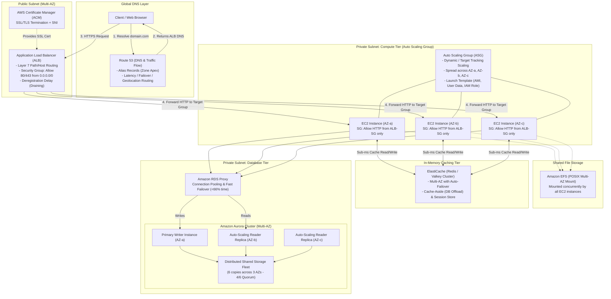
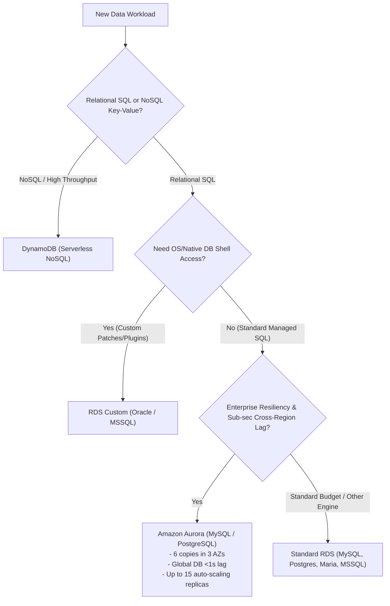

# AWS Certified Solutions Architect Associate (SAA-C03)

## Comprehensive Knowledge Synthesis & Mentorship Discussion Guide

> **Scope Covered:** Modules 00 to 10 (Cloud Foundations, IAM & CLI, EC2 Fundamentals, Advanced EC2 SAA, Instance Storage, ELB & ASG, RDS / Aurora / ElastiCache, Route 53 & Hybrid DNS).

---

## Table of Contents

1. [End-to-End System Architecture Blueprint](#1-end-to-end-system-architecture-blueprint)
2. [Domain 1: Identity, Access & Governance (IAM & CLI)](#2-domain-1-identity-access--governance-iam--cli)
3. [Domain 2: Elastic Compute Cloud (EC2) & Advanced Networking](#3-domain-2-elastic-compute-cloud-ec2--advanced-networking)
4. [Domain 3: Instance Storage Tier (EBS, Instance Store, EFS)](#4-domain-3-instance-storage-tier-ebs-instance-store-efs)
5. [Domain 4: High Availability & Scalability (ELB & ASG)](#5-domain-4-high-availability--scalability-elb--asg)
6. [Domain 5: Data Persistence & Caching (RDS, Aurora, ElastiCache)](#6-domain-5-data-persistence--caching-rds-aurora-elasticache)
7. [Domain 6: Global Traffic Management & DNS (Route 53)](#7-domain-6-global-traffic-management--dns-route-53)
8. [Master Architectural Comparison Matrices](#8-master-architectural-comparison-matrices)
9. [High-Value Discussion Agenda for Your Private Teacher](#9-high-value-discussion-agenda-for-your-private-teacher)

---

## 1. End-to-End System Architecture Blueprint

This diagram illustrates how all components studied across modules 00 through 10 interconnect to form a secure, resilient, multi-AZ, 3-tier enterprise architecture.



---

## 2. Domain 1: Identity, Access & Governance (IAM & CLI)

### 2.1 Core Identity Model & Least Privilege

- **Users & Groups:** IAM Users map 1-to-1 to physical individuals. IAM Groups are collections of users (groups cannot contain other groups).
- **Policies (JSON documents):** Define permissions. Follow the **Principle of Least Privilege** (deny everything by default, explicitly grant minimum necessary actions).
- **IAM Roles vs. Users:**
  - **Users:** Have permanent credentials (passwords, access keys). Intended for humans.
  - **Roles:** Temporary security credentials generated via AWS STS (Security Token Service). Intended for **AWS services** (EC2, Lambda, ECS) and cross-account federation. Never bake static access keys inside EC2 or container code!

### 2.2 Policy Structure & Evaluation Logic

- **Evaluation Flow:** `Explicit Deny` > `Explicit Allow` > `Default (Implicit) Deny`.
- **JSON Anatomy:**
  - `Version`: Must use `"2012-10-17"`.
  - `Statement`: Array of rules containing:
    - `Effect`: `"Allow"` or `"Deny"`.
    - `Principal`: Whom the policy applies to (required in resource-based & trust policies; omitted in identity-based policies).
    - `Action`: API calls allowed/denied (e.g., `["s3:GetObject", "s3:ListBucket"]`).
    - `Resource`: Target ARNs (e.g., `"arn:aws:s3:::my-bucket/*"`).
    - `Condition`: Fine-grained requirements (e.g., enforce MFA, restrict client IP, require TLS).

### 2.3 Auditing & Credential Hygiene

- **IAM Credentials Report (Account-level):** Generates a CSV showing all users in the account and the status of their credentials (passwords, MFA, access key age, last rotated).
- **IAM Access Advisor (Entity-level):** Shows service permissions granted vs. when those services were last accessed. Critical for pruning unused permissions to enforce least privilege.

---

## 3. Domain 2: Elastic Compute Cloud (EC2) & Advanced Networking

### 3.1 Compute Fundamentals: Virtual Machines vs. Containers

- **EC2:** Virtualization at the **hardware level** via a hypervisor (Nitro/Xen). Full OS isolation, dedicated kernel, stateful persistence, 24/7 background tasks.
- **Containers (ECS/EKS):** Virtualization at the **OS level**. Lightweight, shared host kernel, rapid spin-up, portable.

### 3.2 Instance Families & Naming Conventions

- Structure: `[family][generation].[size]` (e.g., `c6g.xlarge` = Compute, 6th gen, Graviton ARM, xlarge).
- **General Purpose (`t`, `m`):** Balanced compute, memory, and networking. (`t` series supports CPU burst credits).
- **Compute Optimized (`c`):** High CPU-to-RAM ratio (batch processing, media transcoding, gaming servers, high-traffic web servers).
- **Memory Optimized (`r`, `x`, `z`):** High RAM-to-CPU ratio (in-memory databases, Redis/Memcached, real-time streaming analytics).
- **Storage Optimized (`i`, `d`, `h`):** High sequential NVMe read/write throughput (OLTP, data warehousing, distributed filesystems).
- **Graviton (`g`):** AWS-custom ARM processors offering 20–40% superior price-performance over comparable x86.

### 3.3 Security Groups: The Stateful Firewall

- Operates at the **ENI level** (not the subnet level).
- **Stateful:** If traffic is permitted inbound, return response traffic is automatically permitted outbound regardless of outbound rules.
- **Default posture:** All inbound traffic is blocked; all outbound traffic is allowed.
- **Security Group Referencing (Chaining):** Instead of whitelisting CIDR blocks (e.g., `0.0.0.0/0`), an instance security group can reference the Load Balancer security group ID as its source. This guarantees zero direct public bypass.

### 3.4 Purchasing Strategies & Spot Fleets

- **On-Demand:** Highest hourly rate, no commitment. Best for unpredictable, spiky, or developmental workloads.
- **Reserved Instances (RI) & Savings Plans:** 1 or 3-year commitment for steady-state workloads (up to 72% discount). Savings Plans offer more flexibility across instance types and regions.
- **Spot Instances:** Excess AWS capacity at up to 90% discount. Can be reclaimed with a 2-minute warning. Best for stateless, fault-tolerant, batch, or distributed processing (Hadoop, video rendering).
- **Spot Fleets:** Combination of Spot and On-Demand instances. Allocation strategies:
  - `priceCapacityOptimized` _(Recommended)_: Selects pools with highest available capacity first, then lowest price.
  - `capacityOptimized`: Maximizes pool depth to prevent interruptions.
  - `lowestPrice`: Optimizes purely for raw hourly cost.
  - `diversified`: Distributes across all configured launch pools for maximum longevity.
- **Dedicated Hosts:** Physical server fully dedicated to you. Required for server-bound software licenses (BYOL - per core/socket) and strict regulatory compliance.
- **Dedicated Instances:** Instances run on dedicated hardware within your account, but you lack low-level socket/core placement control.

### 3.5 Networking: Public, Private, Elastic IPs & ENIs

- **Public vs. Private IP:** Public IPs change on stop/start cycles. Private IPs remain static within the subnet throughout instance life.
- **Elastic IP (EIP):** Fixed public IPv4 address. Architectural note: Limit 5 per account; overusing EIPs is considered an anti-pattern (use DNS names or Load Balancers instead).
- **Elastic Network Interface (ENI):** Virtual network card decoupling network identity from physical compute. Contains primary/secondary private IPs, EIP, MAC address, and security groups.
  - _Use cases:_ Zero-downtime hardware failover (move ENI from crashed node to standby node); Dual-homed network segmentation (management interface on private subnet, public traffic on public subnet).

### 3.6 EC2 Placement Groups

- **Cluster:** Packs instances close together inside a single AZ (same/adjacent racks). Delivers ultra-low latency and 10Gbps+ throughput. _Trade-off: High blast radius (entire cluster fails if the AZ fails)._
- **Spread:** Each instance is placed on physically separate hardware racks with independent power and network switches. Spans multiple AZs. Strictly capped at **7 instances per AZ per group**. _Use case: Critical primary databases and quorum systems._
- **Partition:** Divides the group into logical partitions across hardware racks. Instances in Partition A never share hardware with Partition B. Can scale to hundreds of EC2 instances. _Use case: Distributed big data engines (HDFS, Kafka, Apache Cassandra)._

### 3.7 EC2 Hibernate

- Dumps the contents of RAM directly to the root EBS volume upon stopping.
- On boot, RAM is reloaded without executing full OS boot or reloading memory caches.
- _Prerequisites:_ Root EBS volume must be encrypted, and EBS size must be larger than RAM capacity. Max hibernation period: 60 days.

---

## 4. Domain 3: Instance Storage Tier (EBS, Instance Store, EFS)

### 4.1 Storage Types Comparison Matrix

| Storage Service               | Type                                 | Scope                   | Persistence                                     | Typical Latency         | Primary Use Case                                            |
| :---------------------------- | :----------------------------------- | :---------------------- | :---------------------------------------------- | :---------------------- | :---------------------------------------------------------- |
| **EBS (Elastic Block Store)** | Network Block Storage (SAN)          | **Single AZ**           | Persistent (Configurable `DeleteOnTermination`) | Single-digit ms         | Boot volumes, relational databases, persistent file systems |
| **EC2 Instance Store**        | Physical Local Hardware Block (NVMe) | **Single Host Machine** | **Ephemeral** (Lost on Stop/Terminate)          | Microsecond (Ultra-low) | High-speed cache, buffer pools, temporary scratchpad        |
| **EFS (Elastic File System)** | Managed Distributed NFS              | **Multi-AZ (Regional)** | Persistent                                      | Single-digit ms         | Shared CMS files, concurrent multi-instance read/write      |

### 4.2 EBS Volume Breakdown

- **gp3 (General Purpose SSD):** Baseline 3,000 IOPS and 125 MB/s throughput included. Allows scaling IOPS (up to 16,000) and throughput (up to 1,000 MB/s) independently of storage size.
- **gp2 (Legacy SSD):** Baseline performance is tied directly to volume size (3 IOPS per GB). Replaced by gp3 for cost and flexibility.
- **io1 / io2 Block Express (Provisioned IOPS SSD):** Sustained low-latency performance for critical databases. Up to 256,000 IOPS and 4,000 MB/s throughput with sub-millisecond latency. Supports **EBS Multi-Attach**.
- **st1 (Throughput Optimized HDD):** Up to 500 MB/s for large, sequential I/O (MapReduce, Kafka, log processing). _Cannot be used as a boot volume._
- **sc1 (Cold HDD):** Lowest cost block storage for infrequently accessed sequential workloads. _Cannot be used as a boot volume._

### 4.3 EBS Advanced Mechanics

- **Snapshots & Fast Snapshot Restore (FSR):** Point-in-time incremental block backups saved durably in Amazon S3. FSR pre-warms snapshot blocks to prevent initial-read I/O latency penalty.
- **EBS Encryption:** Encrypts data at rest, data in flight (instance-to-volume), all snapshots, and volumes created from those snapshots via AWS KMS.
  - _How to encrypt an existing unencrypted volume:_ Create snapshot $\rightarrow$ Copy snapshot while checking "Encrypt" $\rightarrow$ Restore new volume from the encrypted snapshot.
- **EBS Multi-Attach:** Allows attaching an `io1` or `io2` volume to up to **16 EC2 instances simultaneously within the SAME Availability Zone**. Requires a cluster-aware filesystem (e.g., GFS2, OCFS2) to prevent write collisions.

---

## 5. Domain 4: High Availability & Scalability (ELB & ASG)

### 5.1 Load Balancer Comparison: ALB vs. NLB vs. GWLB

| Characteristic         | Application Load Balancer (ALB)                                | Network Load Balancer (NLB)                   | Gateway Load Balancer (GWLB)                      |
| :--------------------- | :------------------------------------------------------------- | :-------------------------------------------- | :------------------------------------------------ |
| **OSI Layer**          | **Layer 7** (Application)                                      | **Layer 4** (Transport)                       | **Layer 3** (Network - IP)                        |
| **Protocols**          | HTTP, HTTPS, HTTP/2, gRPC, WebSockets                          | TCP, UDP, TLS                                 | GENEVE protocol (Encapsulated IP)                 |
| **Routing Logic**      | Path (`/api`), Host (`app.domain.com`), Headers, Query Strings | Target IP, Port, Protocol                     | Transparent packet inspection                     |
| **Throughput & Speed** | Dynamic scaling (5–20 ms latency)                              | **Millions of RPS instantly**, sub-ms latency | Line-rate packet routing                          |
| **Public IP Address**  | Dynamic DNS hostname only                                      | **Static IP per AZ** (supports Elastic IPs)   | Elastic IP / ENI                                  |
| **Target Types**       | EC2, ECS tasks, Lambda, Private IPs                            | EC2, ECS tasks, Private IPs                   | 3rd-party Virtual Appliances (Firewalls, IDS/IPS) |

### 5.2 Critical ELB Mechanics

- **Cross-Zone Load Balancing:**
  - _Enabled:_ Requests distributed evenly across all instances in all AZs.
  - _Disabled:_ Traffic distributed equally to each AZ node first, causing load imbalance if one AZ has fewer healthy instances.
  - ALB: Enabled by default (no inter-AZ data fees). NLB: Disabled by default (inter-AZ data transfer fees apply if enabled).
- **Deregistration Delay (Connection Draining):** Allows in-flight requests to complete gracefully (1 to 3,600s; default 300s) before terminating an instance during deployments or scale-in events.
- **Sticky Sessions (Session Affinity):** Forces requests from a user to stick to the same target instance.
  - _Application-based cookies:_ Custom cookie generated by the target application, or `AWSALBAPP` generated by the load balancer.
  - _Duration-based cookies:_ `AWSALB` (ALB) or `AWSELB` (CLB) with an expiration duration.
- **SSL/TLS & SNI (Server Name Indication):** ALB supports SNI, enabling a single load balancer listener to host multiple certificates for different domain names (e.g., `siteA.com` and `siteB.com`).

### 5.3 Auto Scaling Groups (ASG)

- **Launch Template:** The modern, versioned blueprint specifying AMI, instance type, key pair, security groups, user data, and IAM role.
- **Capacity Bounds:** Minimum, Desired, and Maximum capacity.
- **Scaling Policies:**
  - **Target Tracking:** Keeps a metric at a set threshold (e.g., maintain average fleet `ASGAverageCPUUtilization = 50%` or `ALBRequestCountPerTarget = 1000`).
  - **Step Scaling:** Multi-tiered responses based on CloudWatch alarm thresholds (e.g., CPU > 70% add 1, CPU > 85% add 3).
  - **Scheduled Scaling:** Time-based scaling using cron expressions for known spikes.
  - **Predictive Scaling:** Machine learning models forecasting traffic trends 24 hours in advance to launch instances ahead of surges.
- **ASG-ELB Deep Integration:**
  - Instances launched by the ASG are automatically registered with the ELB Target Group.
  - **Health Check Types:** Switching health checks from `EC2` (hardware only) to `ELB` allows the ASG to automatically terminate and replace instances if the application endpoint fails the HTTP `/health` probe.
  - **Scaling Cooldown (Default 300s):** Enforces an idle stabilization window post-scaling to prevent over-compensating.

---

## 6. Domain 5: Data Persistence & Caching (RDS, Aurora, ElastiCache)

### 6.1 RDS: Read Replicas vs. Multi-AZ

```mermaid
flowchart LR
    subgraph MultiAZ["RDS Multi-AZ (Disaster Recovery)"]
        direction TB
        App1["Application"] -->|"Write / Read (Single DNS)"| PrimaryDB["Primary Master DB (AZ-a)"]
        PrimaryDB ==="Synchronous Replication"===> StandbyDB["Passive Standby DB (AZ-b)\n(No traffic accepted)"]
    end

    subgraph ReadReplicas["RDS Read Replicas (Scalability)"]
        direction TB
        App2["Application"] -->|"Writes"| WriterDB["Master DB (AZ-a)"]
        WriterDB -.->"Asynchronous Replication"-.-> RR1["Read Replica 1 (AZ-b)\n(Distinct DNS)"]
        WriterDB -.->"Asynchronous Replication"-.-> RR2["Read Replica 2 (Cross-Region)\n(Distinct DNS)"]
        App2 -->|"Read Queries"| RR1
        App2 -->|"Read Queries"| RR2
    end
```

| Dimension            | RDS Read Replicas                                                       | RDS Multi-AZ                                                  |
| :------------------- | :---------------------------------------------------------------------- | :------------------------------------------------------------ |
| **Primary Goal**     | **Horizontal Read Scalability** & Performance                           | **High Availability & Fault Tolerance** (DR)                  |
| **Replication Type** | **Asynchronous** (Eventually consistent)                                | **Synchronous** (Strictly consistent)                         |
| **Traffic Handling** | Serves read queries directly via replica DNS                            | Standby is passive; accepts no reads or writes                |
| **Failover Process** | Manual promotion to standalone database                                 | **Automatic DNS failover** (60–120s)                          |
| **Network Cost**     | Same region, across AZs = **Free**. Cross-Region = Standard egress fees | Intra-region replication = **Free**                           |
| **Backup Impact**    | Snapshots can be offloaded to replicas                                  | Daily snapshots taken on standby (zero I/O freeze on primary) |

### 6.2 Amazon RDS Proxy

- **The Problem Solved:** Relational DBs maintain heavy state per connection. Serverless architectures (e.g., Lambda) can spawn thousands of concurrent executions, creating connection exhaustion ("Too many connections" errors).
- **Mechanisms:** Maintains a pool of warm connections, multiplexing thousands of client sessions through a small DB pool.
- **Key Advantages:** Reduces failover downtime by up to 66%; enforces IAM database authentication; centralizes credentials in AWS Secrets Manager; private VPC endpoint access only.

### 6.3 Amazon Aurora: Cloud-Native Storage Architecture

- **Storage Engine:** Decoupled from compute. Data is chopped into 10 GB chunks and striped across 100s of storage nodes.
- **Storage Resiliency (The Quorum Model):**
  - Maintains **6 physical copies of data across 3 AZs** (2 copies per AZ).
  - **Write Quorum:** Requires 4 out of 6 nodes to acknowledge a write commit. Survives the loss of an entire AZ plus one additional storage drive without data loss.
  - **Read Quorum:** Requires 3 out of 6 nodes. Self-healing via continuous peer-to-peer data repair.
- **Endpoints Architecture:**
  - **Writer Endpoint:** Points directly to the single primary instance handling writes.
  - **Reader Endpoint:** Performs round-robin connection load balancing across up to 15 auto-scaling Read Replicas.
  - **Custom Endpoints:** Route specific query workloads (e.g., heavy analytical jobs or reporting) to dedicated replica subsets without polluting the general reader pool.
- **Aurora Global Database:** 1 Primary region (read/write) replicates to up to 10 secondary read-only regions with dedicated storage hardware replication. Typical replication lag is **< 1 second**; RTO for cross-region failover is **< 1 minute**.

### 6.4 ElastiCache: Redis vs. Memcached

| Architectural Metric   | Amazon ElastiCache for Redis (Valkey)                  | Amazon ElastiCache for Memcached                 |
| :--------------------- | :----------------------------------------------------- | :----------------------------------------------- |
| **High Availability**  | **Multi-AZ with Auto-Failover** & Read Replicas        | None (No native replication)                     |
| **Persistence**        | Supported via **AOF (Append-Only File)** & Snapshots   | Purely volatile in-memory                        |
| **Scaling & Sharding** | Redis Cluster mode (horizontal sharding + replication) | Pure multi-threaded node partitioning (sharding) |
| **Data Structures**    | Strings, Hashes, Lists, Sets, Sorted Sets, Bitmaps     | Simple Key-Value strings only                    |
| **Security**           | Redis AUTH token / IAM authentication                  | SASL-based authentication                        |

### 6.5 Caching Patterns

1. **Lazy Loading (Cache-Aside):** Application checks cache first. On cache miss, reads from database, populates cache with a TTL, and returns data.
   - _Trade-off:_ Memory efficient (only requested data is cached), resilient to node restarts. Initial cache-miss penalty (3 network hops); risk of stale data until TTL expires.
2. **Write-Through:** Every write or update is written simultaneously to both the database and the cache.
   - _Trade-off:_ Cache is always consistent, eliminating stale reads. Write latency penalty (2 writes); potential cache pollution with data that is never read again.
3. **Stateless Session Store:** Decouples user login sessions from local EC2 instances into a central ElastiCache cluster. Eliminates the need for ALB sticky sessions and allows EC2 instances to terminate during scale-in without logging users off.

---

## 7. Domain 6: Global Traffic Management & DNS (Route 53)

### 7.1 DNS Fundamentals & Route 53 Capabilities

- Highly available, scalable, authoritative DNS service with a **100% Availability SLA**. Operates on Port 53.
- **Public Hosted Zones:** Internet-facing DNS records for public domain routing.
- **Private Hosted Zones:** Internal resolution within specific VPCs (e.g., `db.internal.corp`).
- **TTL (Time to Live):** Determines client-side DNS caching duration. High TTL (e.g., 24h) saves query costs but slows record changes. Low TTL (e.g., 60s) speeds up failover but incurs more Route 53 query fees.

### 7.2 CNAME vs. Alias Records

| Dimension             | CNAME Record                                         | Alias Record (AWS Proprietary)                                     |
| :-------------------- | :--------------------------------------------------- | :----------------------------------------------------------------- |
| **Target**            | Points any hostname to another hostname              | Points a hostname directly to an **AWS resource**                  |
| **Zone Apex Support** | **NO** (Cannot be used on top domain: `example.com`) | **YES** (Supports both root `example.com` and subdomains)          |
| **Cost**              | Standard DNS query pricing                           | **Free of charge** for AWS resource queries                        |
| **IP Tracking**       | Static; resolver handles resolution hops             | Automatically recognizes dynamic AWS IP changes                    |
| **Health Checks**     | Standard DNS health checks                           | Native AWS target health checks                                    |
| **Eligible Targets**  | Any arbitrary URL                                    | ALB, NLB, CloudFront, API Gateway, S3 websites, Global Accelerator |

### 7.3 Routing Policies Deep Dive

- **Simple:** Single record or multiple IP addresses returned at random for client-side round-robin. Does not support health-check-based traffic shifting.
- **Weighted:** Assigns relative weights (e.g., 70% to v1, 30% to v2) for canary deployments or gradual load testing.
- **Failover:** Active-Passive architecture. Queries resolve to Primary until its health check fails, automatically shifting DNS responses to Secondary/DR endpoint.
- **Latency-Based:** Routes traffic to the AWS region that yields the lowest network ping/latency for that individual user.
- **Geolocation:** Routes traffic based on user's **political/geographic boundaries** (Continent, Country, US State). Best for compliance, GDPR, licensing, and language localization.
- **Geoproximity:** Routes based on physical coordinates (latitude/longitude) and AWS regions. Allows using a **Bias** (-99 to +99) to programmatically expand or shrink the catchment area of a specific region.
- **Multi-Value Answer:** Returns up to 8 healthy IP addresses at random with individual health checks. Acts as a DNS-level resilience mechanism without full load balancing.
- **IP-Based:** Routes queries based on client subnet CIDR blocks. Optimized for specific ISP peering arrangements or internal corporate networks.

### 7.4 Health Checks & Automated Failover

- **Endpoint Checks:** 15 global health checkers ping public endpoints over HTTP/HTTPS/TCP. Default interval is 30s (fast interval: 10s). Requires 18% of checkers to report healthy.
- **Calculated Health Checks:** Combines up to 256 child health checks using Boolean logic (`AND`, `OR`, `NOT`) to create aggregated failover triggers without false alarms.
- **Private Endpoint Health Checks:** Route 53 checkers cannot enter private VPC subnets. Solution: Create CloudWatch metrics on internal instances $\rightarrow$ Trigger CloudWatch Alarm $\rightarrow$ Point Route 53 Health Check to monitor the CloudWatch Alarm state.

### 7.5 Hybrid Cloud DNS Resolution

- Solves bidirectional DNS resolution between on-premises data centers and AWS VPCs over Direct Connect or AWS VPN:
  - **Route 53 Inbound Resolver Endpoint:** On-premises DNS servers conditionally forward AWS queries (`*.corp.internal`) to VPC ENIs.
  - **Route 53 Outbound Resolver Endpoint:** VPC EC2 instances resolve on-premises records (`*.onprem.local`) through outbound ENIs via Resolver Forwarding Rules.

---

## 8. Master Architectural Comparison Matrices

### 8.1 Compute vs. Serverless Architectural Paradigms

| Feature                    | Virtual Machines (EC2)                       | Containers (ECS / EKS)                           | Serverless Functions (Lambda)                        |
| :------------------------- | :------------------------------------------- | :----------------------------------------------- | :--------------------------------------------------- |
| **Underlying Abstraction** | Virtual hardware / Hypervisor                | OS process / Kernel namespaces                   | Ephemeral micro-containers (Firecracker)             |
| **Management Burden**      | Full OS patches, security hardening, runtime | Container image, orchestration configuration     | Zero server management; code only                    |
| **Scaling Velocity**       | Minutes (1–3 min for ASG VM boot)            | Seconds (10–30s to pull & run container)         | **Milliseconds** (Instant scale from 0 to thousands) |
| **Execution Duration**     | 24/7 continuous long-running                 | 24/7 continuous long-running                     | Hard limit of **15 minutes** per invocation          |
| **Statefulness**           | Stateful (local files, persistent daemon)    | Generally stateless; supports persistent volumes | Strictly stateless                                   |

### 8.2 Database Engine Decision Tree



---

## 9. High-Value Discussion Agenda for Your Private Teacher

Bring these architecture dilemmas and scenario prompts to your 1-on-1 session to dive deep into real-world trade-offs:

### Topic 1: Blast Radius & High Availability

> _"If an AWS Region is comprised of independent AZs connected by private dark fiber, why would a team ever choose a Cluster Placement Group over Multi-AZ Spread, knowing a single hardware failure can take down the entire cluster? Where is the exact line between raw network performance and fault tolerance in big data/HPC?"_

### Topic 2: Database Scaling Trade-offs

> _"When scaling read-heavy relational databases, what are the subtle risks of relying heavily on asynchronous Read Replicas versus implementing an in-memory Cache-Aside layer with ElastiCache? How do we handle replica lag leading to 'read-your-own-writes' race conditions?"_

### Topic 3: Disaster Recovery RTO/RPO Economics

> _"In multi-region disaster recovery, what are the operational trade-offs between Aurora Global Database (<1 min RTO, storage-level sync) vs. standard cross-region RDS Read Replicas (manual failover promotion)? How does DNS TTL at the Route 53 layer affect true Recovery Time Objectives (RTO) during an outage?"_

### Topic 4: Connection Management & Serverless Anti-Patterns

> _"Why does putting AWS Lambda directly in front of RDS cause database connection pooling failure, and how does RDS Proxy fundamentally change this equation? What architectural constraints remain even when RDS Proxy is introduced?"_

### Topic 5: Traffic Routing Mechanics

> _"What is the practical architectural difference between Geolocation routing and Latency-based routing in Route 53? When could Latency-based routing send a user in France to an AWS region in Ireland instead of Frankfurt, and when would Geolocation be legally required instead?"_
